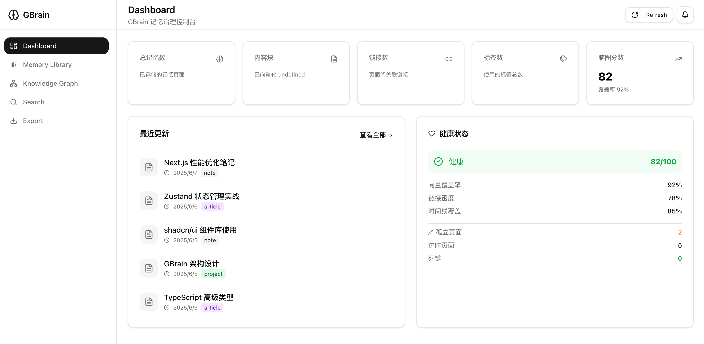
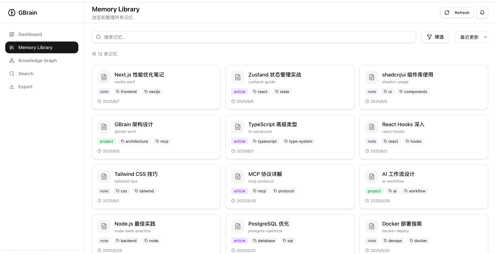
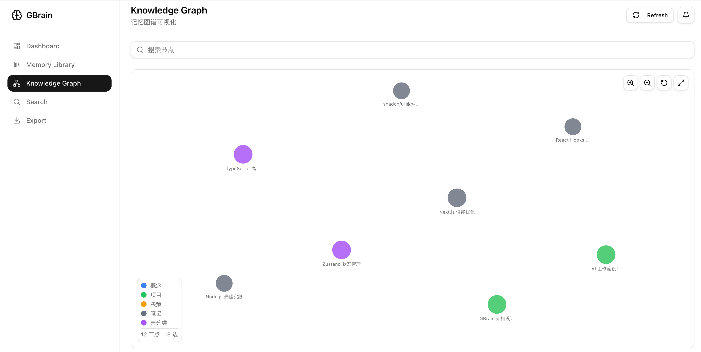

# GBrain Web - Memory Governance Console

> Web UI for GBrain, built on MCP JSON-RPC protocol. Visualize your AI agent's memory as a knowledge graph.

[](https://opensource.org/licenses/MIT)


[中文文档](./README_CN.md)

[](https://vercel.com/new/clone?repository-url=https%3A%2F%2Fgithub.com%2FzhilinYu%2Fgbrain-web&env=GBRAIN_URL,NEXT_PUBLIC_GBRAIN_URL&envDescription=GBrain%20MCP%20server%20URL&envLink=https%3A%2F%2Fgithub.com%2FzhilinYu%2Fgbrain-web%23environment-variables)





## Features

- **Dashboard** - Stats overview, health score, recent updates
- **Memory Library** - Browse memories with type/tag filters and sorting
- **Knowledge Graph** - Interactive force-directed graph of memory connections
- **Memory Detail** - Markdown rendering, backlinks, timeline history
- **Semantic Search** - Keyword and vector similarity search
- **Export** - Batch export memories as JSON
- **Settings** - Token configuration

## Quick Start

### 1. Start GBrain Server

```bash
# Start GBrain MCP server
gbrain serve --http --port 8787

# Create access token
gbrain auth create "gbrain-web" --takes-holders world
```

### 2. Install & Run

```bash
npm install
npm run dev
```

### 3. Configure Token

Open http://localhost:3000, go to Settings:

1. Copy the `gbrain_xxx` token from step 1
2. Paste into the Token input
3. Click Save

## Tech Stack

| Layer | Tech |
|-------|------|
| Framework | Next.js 16 (App Router) |
| Styling | Tailwind CSS 4 |
| UI | shadcn/ui |
| State | Zustand |
| Protocol | MCP JSON-RPC |
| Graph | D3.js Force Layout |

## Project Structure

```
src/
├── app/
│   ├── (dashboard)/page.tsx    # Dashboard
│   ├── memory/
│   │   ├── page.tsx            # Memory Library
│   │   └── [slug]/page.tsx     # Memory Detail
│   ├── graph/page.tsx          # Knowledge Graph
│   ├── search/page.tsx         # Search
│   ├── export/page.tsx         # Export
│   ├── settings/page.tsx       # Settings
│   └── api/gbrain/route.ts    # MCP Proxy
├── components/
│   ├── layout/                 # Sidebar, Header
│   ├── dashboard/              # StatCards, RecentList, HealthStatus
│   ├── graph/                  # GraphViewer
│   └── ui/                     # shadcn/ui components
├── lib/
│   ├── gbrain.ts               # MCP Client
│   └── store.ts                # Zustand Store
└── types/
    └── gbrain.ts               # TypeScript types
```

## Environment Variables

| Variable | Default | Description |
|----------|---------|-------------|
| `GBRAIN_URL` | `http://localhost:8787` | GBrain MCP server URL (server-side) |
| `NEXT_PUBLIC_GBRAIN_URL` | `http://localhost:8787` | GBrain MCP server URL (client-side) |

## MCP Tools Used

| Tool | Description |
|------|-------------|
| `get_stats` | Get memory statistics |
| `get_health` | Get brain health score |
| `list_pages` | List memory pages |
| `get_page` | Get page detail |
| `search` | Keyword search |
| `query` | Semantic search |
| `get_links` / `get_backlinks` | Get page links |
| `get_timeline` | Get page timeline |
| `get_tags` | Get all tags |
| `build_graph` | Build full knowledge graph |

## Contributing

See [CONTRIBUTING.md](./CONTRIBUTING.md) for guidelines. PRs welcome!

## License

[MIT](./LICENSE)
